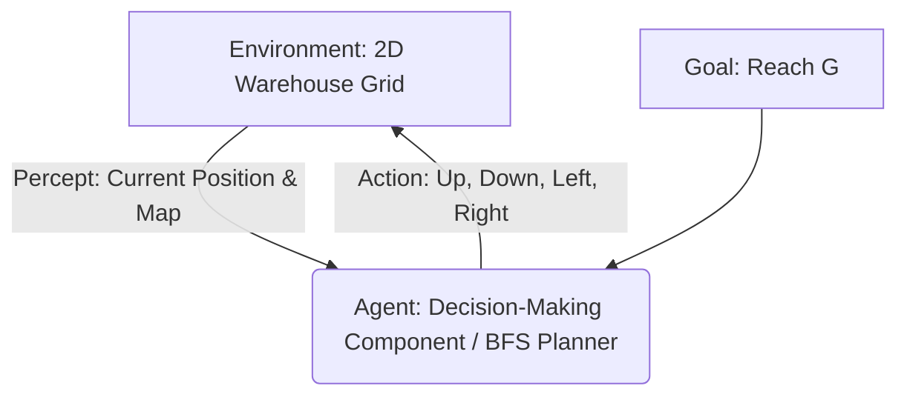

# Laboratory Exercise: Constructing a Goal-Based Agent

## Task 1 – Understanding the Problem

**1. What is the environment?**
The environment is a 2D grid-based warehouse containing a start position (`S`), a goal (`G`), obstacles (`#`), and free space (`.`). It is fully observable, deterministic, static, discrete, and single-agent.

**2. What is the goal of the agent?**
The goal of the agent is to determine a collision-free path from the starting position `S` to the destination `G`.

**3. What actions are available to the agent?**
The available actions are moving Up, Down, Left, and Right. Each move changes the agent's position by exactly one grid square.

**4. What information must the agent maintain in order to choose its next action?**
The agent must maintain its current state (coordinates in the grid), the goal state, the layout of the warehouse (to avoid obstacles), and a memory of previously visited states (to avoid cycles and infinite loops). 

**5. Why is this an example of a goal-based agent rather than a simple reflex agent?**
A simple reflex agent acts only on the current percept (its immediate surroundings) without memory or forward planning, meaning it would easily get stuck in dead-ends or infinite loops in a maze. A goal-based agent, however, considers the future consequences of its actions and plans a sequence of steps specifically designed to reach a defined goal state.

**Think About It:**
*Suppose the warehouse becomes twice as large. Would the same search strategy still be appropriate? What additional difficulties might arise?*
Breadth-First Search (BFS) is still functionally appropriate because it guarantees the shortest path in an unweighted grid. However, as the grid grows significantly larger, the time and space complexity of BFS grows exponentially in terms of depth. Additional difficulties would include increased memory usage (to store the frontier queue and visited states) and longer computation time. For much larger environments, informed search strategies like A* (using heuristics such as Manhattan distance) would be more efficient.

---

## Task 2 – Designing the Agent

- **Environment**: A two-dimensional warehouse grid layout.
- **Current state**: The vehicle's current `(row, column)` coordinates on the grid.
- **Goal**: The vehicle's coordinates matching the goal `G` coordinates.
- **Available actions**: `Up`, `Down`, `Left`, `Right`.
- **Decision-making component**: A pathfinding algorithm (BFS) that evaluates possible valid moves and plans a sequence of actions from the current state to the goal.

**Block Diagram:**



---

## Task 3 – Prompt Engineering

**Prompt Used:**
*(Also saved in `src/prompts.txt`)*
```
Write a well-documented Python program implementing a goal-based agent for the warehouse navigation problem. The map is:
#####################
#S....#............G#
#.##....##########..#
#....##.............#
#.######.###.#.###..#
#........#..........#
#####################
The program should:
- represent the warehouse as a two-dimensional grid;
- determine a collision-free path from S to G;
- avoid all obstacles;
- print either the path found or a suitable message if no path exists;
- explain the search algorithm that has been chosen and why it is appropriate;
```

**Questions:**

**1. Did the LLM generate a working program on the first attempt?**
Yes, the LLM successfully generated a working, syntactically correct Python program that parses the map, finds the path, and outputs the correct sequence of moves.

**2. If not, how can you improve your prompt?**
While the first attempt was successful, prompts can generally be improved by explicitly stating edge cases (e.g., "handle cases where no path exists gracefully"), dictating a specific search algorithm (e.g., "Use A* search for efficiency"), or specifying the desired output format (e.g., "output a list of directional strings").

**3. What search algorithm did the LLM choose?**
The LLM chose Breadth-First Search (BFS).

**4. Why do you think the LLM selected this algorithm?**
BFS is the canonical, optimal algorithm for finding the shortest path in an unweighted grid. Since the warehouse problem involves discrete, equal-cost moves without weights, BFS perfectly fits the requirement to find a reliable, minimal-step collision-free path without unnecessary complexity.
